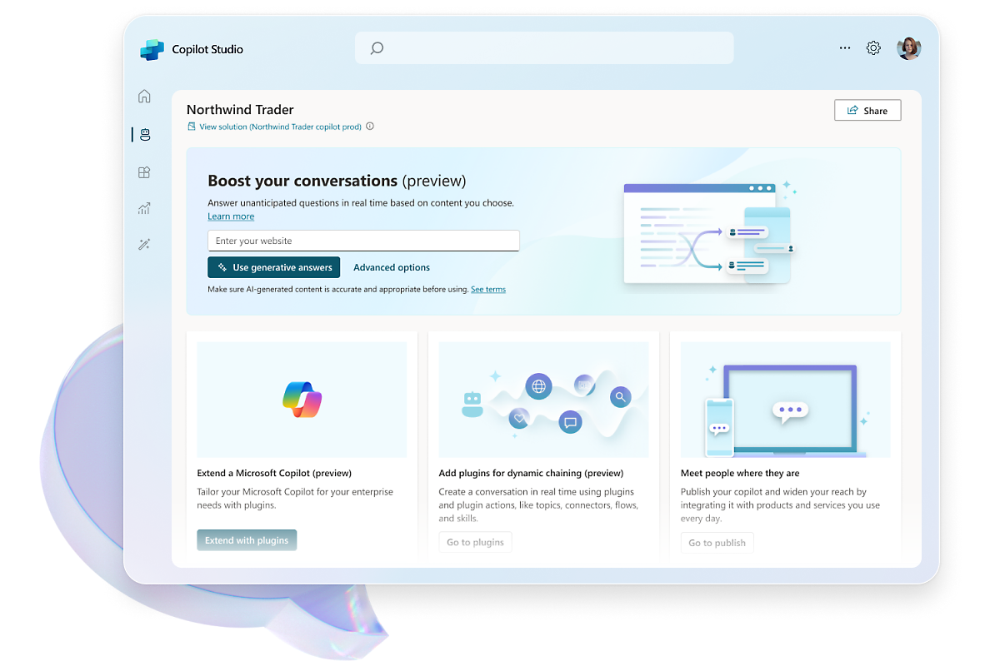
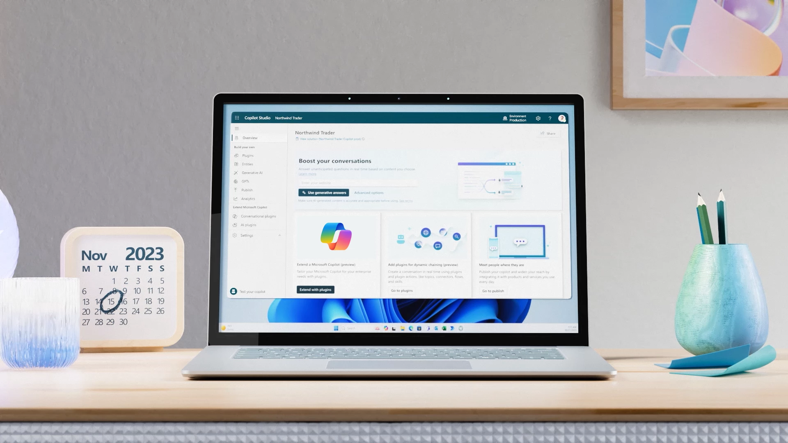
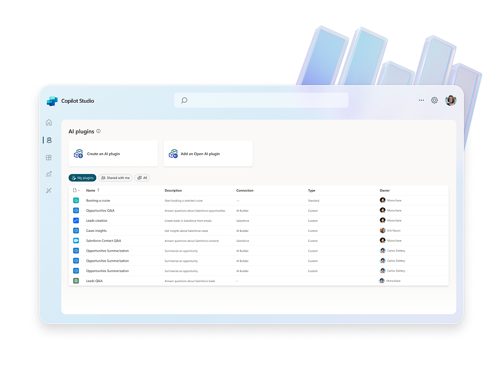
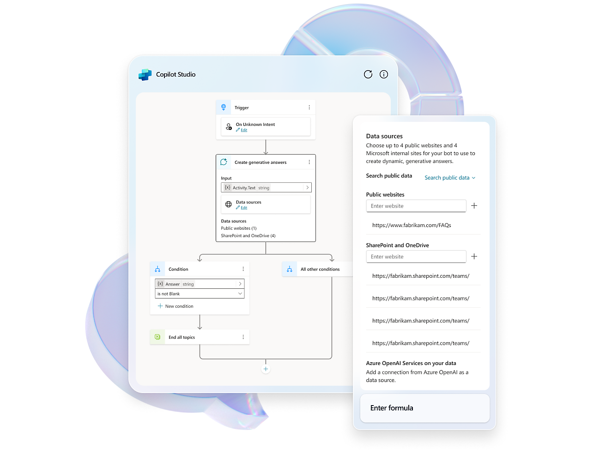
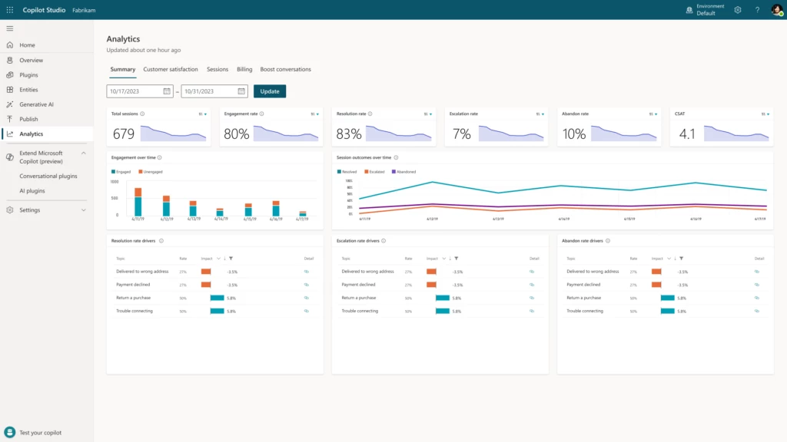

Lancé le **15 novembre 2023***, Microsoft Copilot Studio est une plateforme low code qui offre la possibilité de personnaliser et de créer vos propres assistants conversationnels (copilotes).

Cette plateforme vous donne accès à un environnement de développement visuel pour **la conception**, **le test** et **le déploiement de vos copilotes**. Elle vous permet également d’utiliser des éditeurs de code ou graphiques pour développer des composants et plugins sur mesure.

> En outre, vous pouvez tirer parti des outils d’IA conversationnelle de Microsoft, tels que Microsoft 365, Power Platform, Azure et des API tierces, pour intégrer vos copilotes à diverses sources de données et services. De plus, vous avez la possibilité de surveiller et d’améliorer les performances et la qualité de vos copilotes grâce au tableau de bord analytique intégré et aux rapports.

**La structure tarifaire** est basée sur un abonnement mensuel fixe avec une limite de messages. Pour utiliser la plateforme, vous devez disposer d’un compte Microsoft et d’un abonnement Azure.

Voici une vidéo de presentation de Microsoft Copilot Studio :

## Tarification de Microsoft Copilot Studio

La structure de coût de Microsoft Copilot Studio est basée sur un tarif mensuel fixe (par exemple, **200 $**) pour un quota défini de messages (par exemple, **25 000 messages**). 

Ce tarif comprend **la capacité de personnaliser Copilot pour Microsoft**, de **développer des copilotes** et des **GPT personnalisés**, et d'utiliser une plateforme intégrée qui est compatible avec **les outils d'IA conversationnelle de Microsoft**.

## Comment démarrer avec Microsoft Copilot Studio ?

Pour utiliser le produit, il est nécessaire d'avoir **un compte Microsoft** et **un abonnement Azure**.

Après votre inscription, l'environnement de développement visuel de Microsoft Copilot Studio sera à votre disposition pour la conception, le test et le déploiement de vos copilotes.

L’environnement de développement se présente comme suit :

Pour en savoir plus sur la création et le déploiement d’un copilote Microsoft Copilot Studio, vous pouvez suivre [le guide de démarrage rapide](https://learn.microsoft.com/en-us/microsoft-copilot-studio/fundamentals-get-started?tabs=web) qui vous montre comment créer un copilote simple capable de répondre à des questions sur les produits et services Microsoft.

Vous pouvez également consulter [l’article de blog](https://www.microsoft.com/en-us/microsoft-365/blog/2023/11/15/announcing-microsoft-copilot-studio-customize-copilot-for-microsoft-365-and-build-your-own-standalone-copilots/) pour obtenir des instructions et des exemples plus détaillés.

## Quelles sont les caractéristiques et les possibilités de Microsoft Copilot Studio ?

Microsoft Copilot Studio est bien plus qu’un simple outil de création de copilotes. C’est une plateforme qui offre la possibilité d’exploiter **la puissance de l’IA générative**, de créer **des dialogues sophistiqués**, d’intégrer **des plugins**, **d’automatiser des processus** et de réaliser des **analyses intégrées**. Jetons un coup d’œil à certaines de ces fonctionnalités et capacités qui peuvent vous aider à concevoir des copilotes impressionnants pour divers domaines ou scénarios.

Microsoft Copilot Studio vous offre la possibilité de :

* Adapter facilement Microsoft Copilot à vos propres scénarios d'entreprise.
* Concevoir, tester et déployer rapidement des copilotes autonomes et des GPT personnalisés.
* Gérer et sécuriser vos personnalisations et vos copilotes autonomes grâce à des contrôles d'accès, de données, d'utilisateur et des analyses appropriées.

Microsoft Copilot Studio offre des fonctionnalités telles que :

### L‘IA générative

Une des caractéristiques les plus captivantes de Microsoft Copilot Studio est la capacité d’employer des modèles d’IA générative avancés pour produire des réponses naturelles et engageantes pour votre copilote. L’IA générative, une sous-discipline de l’intelligence artificielle, est capable de créer du nouveau contenu à partir de données préexistantes, comme du texte, des images, du son ou de la vidéo.

Microsoft Copilot Studio vous offre la possibilité de sélectionner parmi **une gamme de modèles d’IA générative** formés sur divers domaines et ensembles de données, tels que Microsoft 365, Wikipédia, les actualités, les livres, etc. De plus, vous avez la possibilité d’ajuster ces modèles avec vos propres données et préférences pour élaborer des modèles personnalisés qui correspondent à vos exigences et à vos objectifs.

### La création de dialogues

Un autre aspect de Microsoft Copilot Studio est la capacité d’employer des méthodes avancées de gestion de dialogues pour orchestrer des conversations complexes et dynamiques avec vos utilisateurs. La gestion de dialogue est le mécanisme qui régule le déroulement et la logique d’une conversation entre un utilisateur et un copilote.

Ces techniques de gestion de dialogue vous permettent de concevoir des copilotes qui sont capables de :

* Gérer plusieurs tâches et requêtes au sein d'une même conversation ;
* Offrir des conseils et un soutien à l'utilisateur tout au long de la conversation ;
* Résoudre les conflits et les incompréhensions avec l'utilisateur ;
* Maintenir une conversation fluide et cohérente avec l'utilisateur ;

### Les plugins

Une autre fonctionnalité de Microsoft Copilot Studio est la capacité d’élargir les capacités de votre copilote en intégrant des plugins qui se connectent à **diverses sources de données et services**, tels que **Microsoft 365**, **Power Platform**, **Azure** et des **API tierces**.

Les plugins sont des éléments réutilisables que vous pouvez développer ou importer depuis le marché de Microsoft Copilot Studio. Vous pouvez utiliser ces plugins pour accéder à des données, les manipuler, effectuer des calculs, initier des actions et vous intégrer à d’autres applications et systèmes.

En utilisant des plugins, vous pouvez créer des copilotes qui sont capables de :

* Fournir des informations pertinentes et à jour provenant de vos sources de données, comme vos systèmes de gestion de la relation client (CRM), de gestion intégrée (ERP) ou de veille stratégique (BI).
* Effectuer des opérations et des calculs complexes sur vos données, par exemple en générant des rapports, des graphiques ou des analyses.
* Exécuter des tâches et des flux de travail en votre nom, comme l'envoi de courriels, la création de documents ou la mise à jour d'enregistrements.
* Interagir avec d'autres applications et systèmes, tels que Microsoft 365, Power Platform, Azure ou des API tierces.

### L’automatisation des processus

Une autre fonctionnalité de Microsoft Copilot Studio est la capacité d’automatiser des processus et des flux de travail habituels pour vos utilisateurs en intégrant votre copilote à Microsoft Power Automate et à d’autres outils d’automatisation.

> Microsoft Power Automate est un service cloud qui vous permet de concevoir et d’exécuter des flux de travail automatisés au sein de vos applications et services. Vous pouvez utiliser Microsoft Power Automate pour relier votre copilote à des centaines de connecteurs et de modèles prédéfinis, ou élaborer vos propres flux personnalisés à l’aide d’un éditeur visuel ou basé sur le code.

### L’analyse

Une autre fonctionnalité de Microsoft Copilot Studio est la capacité de suivre et d'optimiser les performances et la qualité de votre copilote grâce au tableau de bord analytique intégré et aux rapports.

Le tableau de bord analytique vous offre diverses mesures et indicateurs pour évaluer les performances de votre copilote :

* **Utilisation** : Le nombre d'utilisateurs, de sessions, de messages et d'intentions traités par votre copilote.
* **Satisfaction** : Les notes, les commentaires et le sentiment exprimés par vos utilisateurs à l'égard de votre copilote.
* **Qualité** : L'exactitude, la complétude et la pertinence des réponses et des actions de votre copilote.
* **Erreurs** : Les types, les causes et la fréquence des erreurs ou des exceptions rencontrées par votre copilote.

**Microsoft Copilot Studio** est une plateforme puissante et flexible qui offre une multitude de fonctionnalités pour la création, la personnalisation et l’optimisation de copilotes.

Que vous soyez un **développeur expérimenté** ou un **débutant**, cette plateforme vous offre les outils nécessaires pour créer des copilotes impressionnants et efficaces. Alors, commencez dès aujourd’hui et découvrez comment Microsoft Copilot Studio peut transformer votre façon de travailler et d’interagir avec vos utilisateurs.